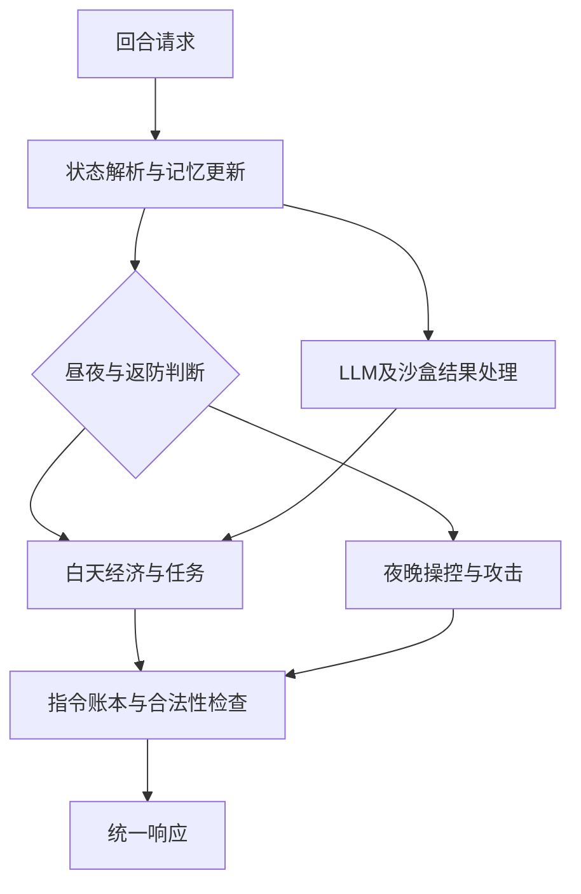

# 《未来战争》v1.0 设计思路

版本：1.0 · 日期：2026-09-14 · 语言：Python 3.11+

## 1. 设计目标

本项目实现比赛参赛端智能体：读取当前回合地图、角色、机器人、任务与新闻，输出合法的角色动作、LLM 提示词和任务沙盒命令。游戏地图生成、机器人行为、伤害结算、任务判分均由官方判题器负责。

目标顺序为：**维持有效响应 → 保住基地 → 建立可持续经济 → 提高任务与击杀收益**。这不是对最优解的证明，而是一条能快速运行、验证、迭代的工程路线。

任务书规定异常累计达到 5 次后不再调度该队，因此错误处理和动作合法性本身影响比赛结果。双方基地在不同回合被摧毁时，先被摧毁的一方判负；两队均存活等情形再比较积分，故不能只追逐单次任务分数而放弃防守。

## 2. 将任务书拆成三个闭环

| 闭环 | 输入 | 决策 | 下一回合反馈 |
|---|---|---|---|
| 经济建设 | 资源分布、背包、金币、商店价格、建筑 | 采矿、卖矿、建造、购买、使用升级券 | 实际背包／金币／建筑与动作执行结果 |
| 防御作战 | 夜间机器人位置、射程、冷却、角色位置 | 分配操控者、选择目标、移动归位、使用急救物品 | 当前机器人血量、己方血量、武器冷却 |
| 信息任务 | 新闻、任务原文、LLM 回包、沙盒结果 | 领取、探索、回答、记忆、宝藏推断 | `phaseTask`、错误数组、命令输出、宝藏结果码 |

三个闭环共享同一份本回合状态和指令账本，任何模块都不直接向 HTTP 输出内容。

## 3. 分层决策架构

地图是 41×32，角色只有三名，使用规则策略、图搜索和小规模枚举即可得到可解释的基线。LLM 用于非结构化新闻和动态任务；常规移动、建造、购买、武器攻击由确定性代码计算，避免每个动作都等待模型。

## 4. 白天策略

### 4.1 开局与角色分工

默认武器组合为加特林、电磁狙击炮、火箭发射台各一座，目的是覆盖近距连续输出、穿透输出和范围输出。该组合是策略默认值，不是经对战优化得到的最优阵容。

若实际费用等于 demo 中的每座 25 金币，则初始 75 金币刚好支持三座一级武器。费用尚需核对任务书图片，因此代码从配置读取，绝不把这笔预算作为已验证规则。

- 第一名存活工人负责主要建造和石料补充，围墙目标随天数增加。
- 第二名工人主要采矿、交易和购买升级券，缺武器且金币足够时也参与建造。
- 开拓者在白天处理任务；新闻能够明确支持宝藏地点、用品和时间时，尝试宝藏流程。
- 各角色距离武器操作位的实际寻路距离决定返防时刻。

### 4.2 收益与资源管理

采矿候选用以下启发式评分：

\[
V_{mine}=\frac{当回合矿石收购价}{1+到矿区邻格的最短路长度/卖矿批量}
\]

这能在高单价远矿与低单价近矿之间作简单折中。缺石料的建造工人优先石矿，其余时候使用 `vendorShopList` 的真实价格。默认累计一批矿石后去小贩批量出售，避免每采一块就往返。

每回合共享金币只扣除已计划购买和建造的费用，不将本回合计划卖矿收入提前用于支出，以免依赖未明确的同回合结算顺序。下一回合再读取真实金币。

升级优先补齐低等级武器，其次升级基地；正在携带升级券时先前往适用建筑使用。默认不主动购买召唤令，后续可用正式对战结果评估其相对防御投资的收益。

### 4.3 建筑与交通

建造只允许使用配置认可的武器格或围墙格。默认推导模式以基地四格占地为中心生成邻圈，属于未经官方图验证的 demo 推导；显式坐标模式使用人工确认的白名单。

默认围墙保留两格开口。在落墙前，重新检查当前可达的基地与交易区域路径是否仍然可达，尽量避免把己方角色困住。某建造指令反馈失败后，该位置暂缓 20 回合重试；此机制只能降低反复失败，不能推断失败原因或证明坐标合法。

## 5. 夜间策略

### 5.1 操控者分配与返防

每个武器都需要一个相邻角色操控。对最多三个角色和三座武器枚举分配，成本为到武器邻格的最短路长度之和，优先降低就位时间。实际执行移动时重新计算路径，避开本回合已预留的目标格。

返防触发条件：

\[
白天剩余回合 \le 到操作位最短路长度+返防缓冲
\]

默认缓冲为 5 回合。返防角色本回合不再领取任务、采矿或购买物品。正在执行的任务也可能因返防中止，这是生存优先策略的明确代价。

### 5.2 武器目标选择

| 武器 | 输出约束 | 基线决策 |
|---|---|---|
| 加特林 | 落点数等于等级；任意两个方向夹角不超过 90° | 用向量点积过滤不符合锥形的候选，优先削减高威胁机器人血量 |
| 电磁炮 | 一个落点；沿路径消耗穿透能量 | 对候选弹道计算剩余能量和沿线伤害收益 |
| 火箭 | 落点数等于等级；冷却时不发射 | 计算中心 20、周围八格 10 的溅射收益，可重复落点叠加伤害 |

威胁分综合机器人到基地距离、类型和 `targetTeam`。当前能攻击的机器人都可作为候选，优先处理威胁己方者。默认不主动进攻敌方角色和建筑。

维护本回合计划伤害，降低多个武器重复攻击已预计击杀目标的概率。该伤害账本是启发式估算，不能替代官方伤害结算；弹道边界、遮挡与同回合穿透行为必须用判题器校准。

### 5.3 紧急物品

夜间分配炮手之前，低血量角色可使用已有 `Medicine`。基地附近形成机器人集群时，可使用背包内的 `Bomb` 或 `DizzyWeapon`；一回合最多计划一件范围应急物品，减少同回合过度消耗。使用者本回合不再充当炮手。

## 6. 任务、推理与记忆

### 6.1 自进化任务

任务点由 `teamOur.playerTasks` 选择，不使用固定角色 ID 或写死阵营坐标。领取前检查有效性、冷却和白天剩余时间；任务执行期间开拓者保持原位，直到提交、超时策略触发或必须返防。

任务流程：发送提示词 → 下一回合读 `llmResp` → 根据 JSON 结果提交答案或发送 `executeCmd` → 下一回合读 `lastCmdResult` → 带执行结果再次请求解题。

提示词明确要求区分“答案”与“需要执行的 Python”。代码只构造官方沙盒命令，不在 HTTP 主机上执行模型生成内容。结果包含退出码、超时与截断标志时，原样放入下一轮上下文供纠正。

LLM 可返回可复用解题步骤。缓存用任务文本相似度检索，只作为下一次任务的参考。当前接口没有稳定的任务 ID 和显式全通过标志，因此缓存标为“未验证提示”，不伪称已学会的成功 SKILL，也不自动执行缓存命令。

### 6.2 官方消息与宝藏

保留至多十条带天数的新闻记录，在新证据出现时调用 LLM。普通日每日最多三次，任务执行期间按接口约定免计数。新闻推理采用严格 JSON，缺乏明确依据时返回空宝藏结论。

宝藏候选必须包含范围内坐标、精确用品名称与数量、有效开放回合区间、依据和足够置信度。推理置信度并不等于真实概率；它只是减少盲目尝试的策略阈值。

执行前检查背包数量、金币、商店商品、到达时间与相邻距离。因为合法召唤即使失败也会消耗用品，每套候选方案只尝试一次；只有新证据产生不同方案才重新允许尝试。结果码 1 或 4 后停止后续寻宝。

## 7. 可靠性设计

- 先解析统一状态，再调用策略；不在多个模块各自猜测字段含义。
- 所有动作经过同一指令账本，约束角色使用、金币、移动目标和建筑数量。
- 基地按“左上角锚点”展开四格；存活敌方单位、中立单位、矿区、任务点均进入障碍集合。
- 寻路采用八邻域 BFS，符合切比雪夫距离和允许对角穿越的规则。
- 重复请求缓存响应，回合回退重置记忆，换边状态隔离。
- 决策预算到期返回已合法化的动作；未预料的异常由 HTTP 层返回完整空响应并记录日志。

## 8. 迭代路线与验收边界

先核对不可访问图片中的规则，再在官方判题器完成一局运行，随后开展双边位置测试和多地图批量对战。优化时比较胜率、存活天数、任务得分、击杀得分、动作失败率和 P95/P99 响应时间，分别测试武器组合、返防余量、采矿批量与升级优先级。

当前交付已经实现以上基线流程与自动化测试，但没有官方引擎验证和真实对战成绩。需要用户补充建筑区域图、建筑属性表或判题器后，才能把布局与弹道假设收敛为比赛级规则实现。
