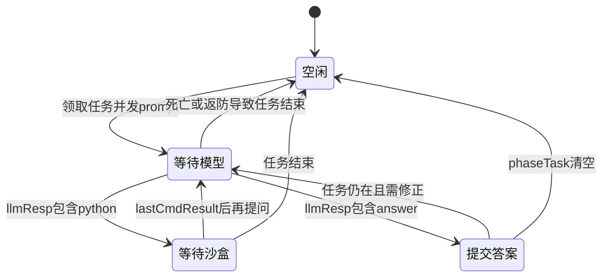

# 《未来战争》v1.0 Python 智能体设计文档

版本：1.0 · 日期：2026-09-14

## 1. 项目范围与设计依据

输入为官方判题器每回合发送的 JSON，输出为 `roleCommandMap`、`prompt`、`executeCmd`。系统长期运行，监听启动参数指定的端口；不承担地图渲染、机器人 AI、战斗结算、积分裁定或模型服务部署。

依据为仓库 `czb1/win`，固定版本 `f0b5dfc28e7779d5700e0cf0bdd07a91e5403ab4` 中的任务书、接口文档、SDK、demo 及样例。用户图片要求的入口关系 `SDK/SDK_Python/CoreGeek/main3.py` 已落实。来源与待确认信息详见 `来源与差异.md`。

## 2. 需求追踪

| 规则／需求 | 对应实现 | 验证方式或边界 |
|---|---|---|
| HTTP 服务及端口参数 | `main3.py`、`server.py`、`run.sh` | 本地真实 POST 与健康检查 |
| 白天 70、黑夜 60，最多 1300 回合 | `Turn.day/tick/is_day` | 关键切换回合和 1300 回合协议遍历 |
| 基地 2×2，位置是左上角 | `Unit.cells` | 四格占地断言 |
| 八方向移动，切比雪夫距离 | `navigation.py` | 对角移动、到达与无路可达测试 |
| 全部可见单位及中立元素阻挡 | `Turn.blocked` | 敌方基地、死单位和矿区测试 |
| 单角色单动作，操控者不可重复使用 | `Ledger.used` | 控制者锁定、同格争抢测试 |
| 建造时共享金币、武器上限三座 | `Ledger.gold/new_towers` | 预算不足、夜建禁止、数量上限 |
| 建造区和费用 | `Config`、`layout()` | 默认 demo 推导；需核对官方图片 |
| 武器等级决定目标数量 | `select_targets()`、`Ledger.add()` | 一级至三级与锥形约束测试 |
| 火箭冷却及溅射，电磁穿透 | `combat.py` | 手工小场景测试；弹道边界待引擎校准 |
| 批量采矿、交易、升级 | `economy.py` | 背包、商店、共享预算和库存限制 |
| 阵营专属任务及任务点2占两格 | `Turn.task_cells()`、`pioneer()` | 两格任务点单元测试 |
| 任务 LLM 与沙盒异步结果 | `Memory.observe()`、`Intelligence.task()` | 四回合交互及跳回合丢弃旧结果 |
| 普通每日三次 LLM，任务期豁免 | `Intelligence.can_call()` | 配额及跨日重置测试 |
| 新闻记忆、停采推断、宝藏 | `intelligence.py`、`pioneer()` | JSON 结构、证据、数量和时间门槛 |
| 异常保护 | `server.py`、决策预算 | 错误 JSON、错误状态与恢复测试 |

## 3. 工程结构与职责

项目使用标准库，无 Flask、NumPy、网络模型 SDK 或在线安装要求。

| 文件 | 主要公开对象 | 职责 |
|---|---|---|
| `main3.py` | `main()`、`callback()` | 参数解析、配置、日志及服务入口 |
| `config.py` | `Config.load()` | 参数加载、类型校验、可变规则集中管理 |
| `model.py` | `Unit`、`Turn` | 协议归一化、单位筛选、地图与物品索引 |
| `navigation.py` | `Navigator`、`layout()` | 八邻域搜索、目标邻格寻路和建造布局 |
| `commands.py` | `Ledger`、`command()` | 动作结构生成与本回合资源约束 |
| `combat.py` | `assignments()`、`defend()` | 炮手分配、武器目标选择、紧急物品 |
| `economy.py` | `worker()`、`pioneer()` | 建造、矿石经济、升级、寻宝与领任务 |
| `intelligence.py` | `Memory`、`Intelligence` | 新闻、配额、任务多轮交互与提示缓存 |
| `brain.py` | `Agent.decide()` | 模块编排、预算、会话与重复请求缓存 |
| `server.py` | `Server`、`Handler` | HTTP 生命周期、串行决策和兜底响应 |

## 4. 数据模型与状态管理

### 4.1 回合模型

`Turn` 读取 `roundNo`、`mapInfo`、`teamOur`、`teamEnemy`、`robot`、任务和价格信息。坐标用 `(x, y)` 整数元组表示，序列化时转换为 `{x, y}`。

默认按首回合为 1 计算：

\[
day=\lfloor(roundNo-1)/130\rfloor+1,
\quad tick=(roundNo-1)\bmod130
\]

`tick < 70` 为白天。可配置首回合编号 0，但同一局不能混用口径。

`Unit` 保留 id、类型、位置、生命、等级、射程、攻击力、冷却、容量、背包和目标阵营。优先使用输入中的 `attackRange`、`attackPower`、`cooldown`；没有正射程的武器不发出攻击，避免用 demo 的范围表掩盖缺失值。背包使用 `Counter` 计数，因此可正确检查重复任务用品。

基地锚点 `(x,y)` 的占地为 `(x,y)`、`(x+1,y)`、`(x,y-1)`、`(x+1,y-1)`。只有 `health>0` 的单位进入存活集合和占地计算。

### 4.2 记忆模型

会话键为队伍 ID、阵营及当前存活基地锚点。最多保留八个会话，超出淘汰最久未使用会话。

| 字段组 | 保存内容 | 限制与更新 |
|---|---|---|
| 回合缓存 | 上次回合、输入摘要、响应 | 同一状态重复请求直接返回副本 |
| 新闻 | 带天数的官方消息和民间传闻 | 至多十条，每条有文本长度上限 |
| LLM 调度 | 当日使用次数、待处理用途与发出回合 | 单个未完成请求；跨日重置计数 |
| 任务 | 原文、开始回合、任务点、超时值、答案或代码 | 原文变化时清理任务工作状态 |
| 任务交互历史 | 最近模型候选和沙盒输出 | 至多六项，截断长输出 |
| 可复用提示 | 任务摘要、步骤、`verified=false` | 至多八条，按文本相似度检索 |
| 宝藏 | 地点、用品、时间、依据、是否尝试、是否结束 | 候选改变时重新允许一次尝试 |
| 失败退避 | 建造格及采集格的可重试回合 | 过期删除 |

仅消费发出回合的下一回合结果。若跳回合，清除等待标记并丢弃不明归属的结果。接口无请求 ID，此做法能减少串线，但不能恢复丢失的历史。

记忆保存在进程内；不作磁盘持久化。任务书规定异常退出后不再拉起，因此基线优先保证进程不因单次决策异常终止。完全相同的首回合状态不能与同进程重新开始的另一场比赛可靠区分，生产接入应沿用官方“每局启动一次”的约定。

## 5. 每回合处理流程

1. 解析请求并构建地图、单位、背包和价格索引。
2. 定位会话，必要时重置，检查完全相同的重复请求。
3. 消费上一回合动作结果、LLM 回包、命令输出及新闻。
4. 创建指令账本和决策截止时间。
5. 夜间先考虑已有急救／范围物品，然后分配炮手。
6. 按最短路与剩余白天回合确定需要返防的角色。
7. 夜间移动或攻击；白天执行返防、工人经济、开拓者任务。
8. 有空余信息通道时分析新新闻；返回统一 JSON。
9. 保存回合摘要、响应及已发动作，供下一回合反馈处理。

没有动作的角色不出现在 `roleCommandMap`。基地、围墙不直接发指令。武器攻击时以武器 ID 为键，并通过 `controllerId` 字符串引用角色。

## 6. 指令账本与协议设计

### 6.1 统一响应

```json
{
  "roleCommandMap": {
    "10020": {
      "action": "attack",
      "controllerId": "10010",
      "targetPos": [{"x": 12, "y": 22}]
    }
  },
  "prompt": "",
  "executeCmd": ""
}
```

上例只说明一级武器的结构，坐标和攻击是否可行要由真实状态决定。不能把上游 `response.txt` 的同角色多个动作同时发送。

### 6.2 校验范围

`Ledger.add()` 同时检查单位存在且存活、角色类型、昼夜、动作必选字段、目标数量、坐标边界、相邻距离、背包数量、购买容量、金币和武器数量。落地指令后更新 `used`、`reserved`、`gold`、`new_towers`、`purchases`。

| 动作 | 额外检查 |
|---|---|
| `move` | 八邻格、非障碍、非已预留目标；保守阻挡所有当前角色格以避免互换 |
| `attack` | 夜间、武器 ID、操控者相邻且空闲、射程、冷却、等级目标数和加特林锥形 |
| `build` | 白天工人、布局白名单、目标未占用、费用或石头、三武器上限 |
| `collect` | 工人、矿区邻格、背包容量 |
| `buy/sell` | 商店／小贩邻格、正整数数量、价格、库存或容量 |
| `acceptTask` | 开拓者、己方有效无冷却任务、相邻、无已领取任务 |
| `submitAnswer` | 开拓者、有当前任务、答案为字符串 |
| `summonTreasure` | 开拓者、相邻坐标、用品数量充足；推理门槛在策略层检查 |
| `use` | 背包有物品；升级／修墙有适用建筑、坐标和相邻距离；范围物品有目标 |
| `drop/remove` | 背包或围墙目标、角色限制、必要坐标；默认策略不主动拆墙丢物 |

校验器并不是完整游戏规则引擎。任务和弹道的真实执行结果、隐藏敌方位置、建造区真值以及任务答案正确性仍由判题器决定。合法指令在引擎中执行失败不等于响应格式异常。

## 7. 路径规划与协同

每个栅格与周围八格连边，边权为 1，采用 BFS。允许从相邻障碍之间斜向经过；不额外加“斜向两侧必须空闲”的约束。

对矿区、任务点、商店、建筑的交互不是走到对象格，而是搜索其周围可站立格的集合。任务点2根据同名中立类型合并两格，任一格的合法邻格均可交互。任务书关于“处于任一格”的表述与“任务点阻挡移动”存在口径风险，本实现优先采用接口及行为表的相邻交互口径，待判题器确认。

查询 `start==goal` 返回长度 0 且无移动动作。无路返回 `None`。地图每回合重建，矿区刷新和建筑拆除会自动反映在下一回合。

同回合多角色使用目标格预留；其它角色的当前格始终视为障碍，牺牲部分可合法跟随移动的机会以避免交换位置与等待依赖。未知敌方动作和机器人移动仍可能导致碰撞，不能由单边预留消除。

## 8. 战斗算法

### 8.1 分配

对于存活角色与武器，先预计算两两操作位最短路，再枚举配对求总路程最小。最多三角色、三武器，排列枚举最多 36 组；未能配到武器的角色尝试靠近基地。

### 8.2 几何与伤害

采用 supercover 栅格遍历近似中心连线，接触格角时保守纳入侧格。建筑、中立对象与可见角色作为直射弹道遮挡；火箭忽略弹道阻挡。当前按武器中心作为弹道起点，延续 demo 用法，但任务书对示意图起点的文字有歧义，必须与官方结算核对。

加特林点积校验：若两个方向向量 `a,b` 满足 `a·b>=0`，夹角不超过 90°。对所有落点对检查，保证整个输出满足两两约束。每发估算 10 点伤害，沿路径命中最近机器人。

电磁炮以输入 `attackPower` 作为可用能量，按照沿线距离依次分配 `min(剩余能量,预计剩余生命)`；选累计威胁加权收益最高的终点。多个武器同回合的过杀和穿透时序仍属近似。

火箭评估当前机器人所在格作为落点候选，中心伤害 20、切比雪夫距离 1 的其它格伤害 10；按等级选择多个落点并扣除计划伤害。没有枚举全部空格中心，可能错过对某些分散机器人更好的落点，这是当前基线的优化空间。

## 9. 任务与新闻状态机



这是跨回合逻辑，HTTP 请求不等待 LLM 或沙盒执行。每回合只构造一个新提示词或一个沙盒命令。

模型答案协议支持：

```json
{"answer":"按任务要求组织的答案","skill":"可复用但仍需验证的步骤"}
```

或：

```json
{"python":"print(1 + 1)"}
```

允许整体包裹一个 Markdown JSON 代码围栏，不接受前后随意解释文字。任务代码先以 `compile(..., 'exec')` 做语法检查，然后通过 `shlex.quote` 封装为 `python3 -c ...`，交给判题器执行。不会使用 `eval`、`exec` 或本地 subprocess 执行模型建议。

新闻协议要求 `oreOutages` 与可空的 `treasure`。名称必须匹配实际商品列表，保留任务书中 `AcientTablet` 的原始拼写，不擅自改成另一个商品名。新新闻或无效 JSON 可触发重试，但仍受普通日三次配额约束。

任务提示缓存不是经验证的程序库。后续若官方增加任务 ID、显式通过率／成功标志，可升级为“执行成功后入库、参数化、再验证”的 SOP 流程。

## 10. HTTP、时限与异常

`ThreadingHTTPServer` 负责连接，决策使用单锁保护共享会话。取得决策锁最多等待 50ms；并发竞争失败时返回完整空响应，不访问不完整记忆。正常判题应串行发送回合请求。

| 场景 | 返回行为 |
|---|---|
| 正常 `POST /` | HTTP 200 与完整响应三字段 |
| `GET /healthz` | HTTP 200，`{"status":"ok"}` |
| 非法 JSON、非对象、编码错误、非标准数值 | HTTP 400 |
| 无有效请求体长度或超过 2 MiB | HTTP 413 |
| 未支持路径 | HTTP 404 |
| 合法 JSON 但状态解析／决策异常 | HTTP 200，完整空动作响应；stderr 异常日志 |
| 决策内预算到期 | 返回已校验动作，不终止进程 |
| 客户端断开 | 记录警告并关闭该连接 |

连接读取设置 0.5 秒超时，决策默认预算 3.5 秒。搜索和目标枚举循环定期检查预算。该设计预留官方 5 秒响应时限余量，但不是操作系统级硬抢占；输入解析、极端大请求、调度负载仍需在真实比赛环境压测。官方沙盒 15 秒限时由判题器执行，不计入本地 LLM 等待。

## 11. 复杂度与资源

令栅格数 `V=W×H`、机器人数量为 `R`、候选交互点数为 `Z`。

- 单次 BFS 时间与空间均为 `O(V)`，本地图正常仅 1312 格。
- 配对阶段最多九次主要路线查询，再做至多 36 个组合比较。
- 经济模块为候选资源和建造点各做一次搜索，约 `O(ZV)`。
- 射线遍历为 `O(max(W,H))`；当前伤害评分需要逐候选扫描机器人，电磁炮还需按路径距离排序，约为 `O(R² log R + R·max(W,H))`。没有声称机器人数量任意增长时仍保持同样时延。
- 通过最多三级目标数量、地图尺寸上限、请求体上限与时间检查限制工作量。后续若大波次压测成为瓶颈，应建立空间索引并把机器人威胁值预计算。

内存主要用于输入模型、BFS 队列与最多八个受长度限制的会话。当前测试未报告 RSS 峰值，不推断未知内存表现。

## 12. 配置说明

| 参数 | 默认 | 含义 |
|---|---:|---|
| `round_origin` | 1 | 第一回合编号 |
| `layout_mode` | `demo_inferred` | 基地邻圈推导或 `explicit` 白名单 |
| `weapon_cost` | 25 | demo 来源，待确认 |
| `wall_stones` | 1 | demo 隐含用量，待确认 |
| `weapon_cells/wall_cells` | 空数组 | 显式模式的绝对建造坐标 |
| `loadout` | 三种武器各一 | 最多三个建造槽位的类型顺序 |
| `stone_batch` | 6 | 建造工人石料优先策略阈值；可建时会先用现有石料 |
| `sell_batch` | 12 | 卖矿批量门槛及路程摊销参数 |
| `return_margin` | 5 | 日落前返防缓冲 |
| `task_min_rounds` | 8 | 领任务所需的最小可用时长 |
| `task_max_rounds` | 40 | 本策略主动投入单任务的最多回合，可低于官方超时 |
| `llm_enabled` | true | 开启官方 LLM 任务与新闻通道 |
| `daily_llm_limit` | 3 | 普通每日调用上限，不能配置大于三 |
| `max_python_chars` | 12000 | 单次模型代码字符数限制 |
| `max_body_bytes` | 2097152 | HTTP 输入上限 |
| `decision_seconds` | 3.5 | 决策预算，须小于五秒 |
| `build_retry_rounds` | 20 | 失败建造格退避回合 |

## 13. 测试与验收

自动化测试包含协议单元测试、跨回合逻辑测试、真实本地 HTTP 交互和静态地图的 1300 回合编号遍历，实际结果见 `测试报告.md`。这些测试不会模拟矿石消耗、造塔结算、机器人进攻、任务得分或基地产生的生命损失，因此不等价于完整一局对战。

正式验收还需要：

1. 使用 Python 3.11.10 和比赛启动器验证端口与进程生命周期。
2. 从官方图或规则实现中导入合法建造区域和真实造价。
3. 对双方基地、任务点2的两格邻域与上下半场换边实测。
4. 验证一级至三级三种武器的弹道、遮挡、重复落点、冷却与目标数。
5. 验证模型额度、命令执行、任务结束和错误反馈的真实时间顺序。
6. 跑完整双边对局并保存胜负、分类得分、动作失败率与 P95/P99 延迟。

完成这些验证前，本项目定位为有测试支撑的完整参赛端基线，不宣称官方验收通过或最优获胜策略。
